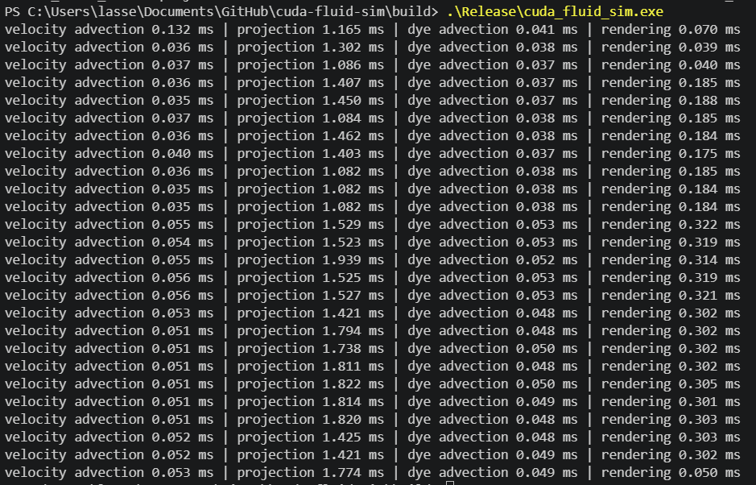
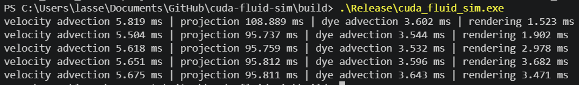
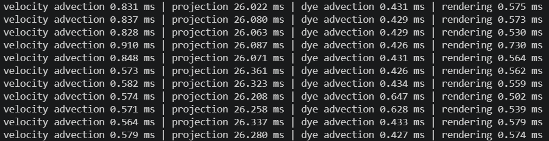
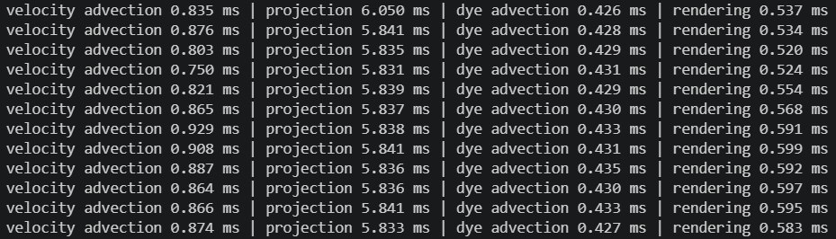
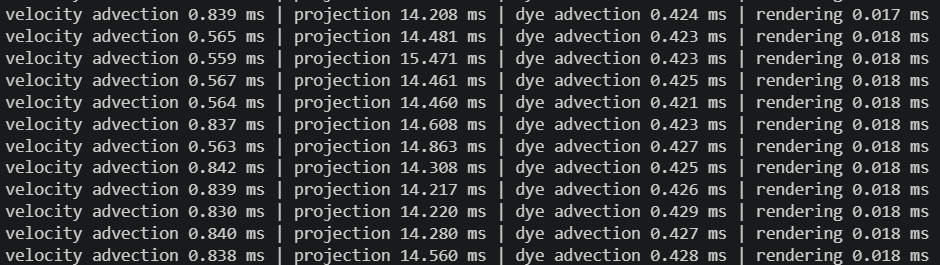
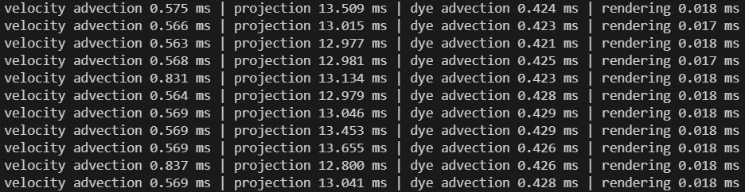

# Simple 2D
512² grid

# Simple 3D
128³ grid, 40 jacobi iteraionts

256³ grid, 40 jacobi iterations

128³ grid, 100 jacobi iterations

128³ grid, 20 jacobi iterations

# Optimized 3D
40 Jacobi iterations

128³ grid, tile size 8

128³ grid, tile size 10

Note that 10 is the maximum, since the thread limit is 1024.